<div align="center">


# Kolibre

**A self-hosted home for everything around your reading.**

Your library, your devices, your highlights and your reading history —
in one place, on your own machine.

</div>

---

Kolibre started as a home-server library manager with one goal: **centralise everything
that surrounds reading, and get out of the way of the reading itself.**

It keeps your books, pushes them to your e-readers and takes them back, collects what you
highlighted and how long you read, and knows who wrote what. It is not a reading app. It
is the place everything else happens, so that the reading app can stay a reading app.

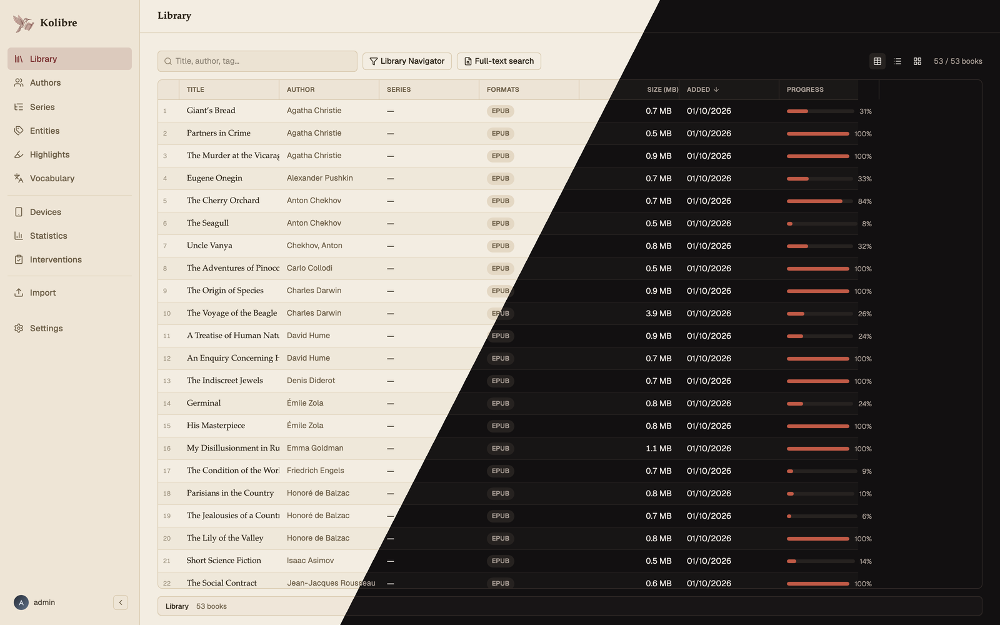

---

## The reading flow

This is the loop the whole program is built around. Four steps, and you only touch two of
them.

**One page for the library.** Clean, complete, fast — every book, every author, every
format, nothing you have to go and look for somewhere else. From here you send a book to
your e-reader: you choose on the server, and that is the last decision you make.

**Then you read.** On the device, in KOReader, with nothing in the way. No app asking you
to rate it, no sidebar, no sync button to remember. Just the book.

**Everything comes back on its own.** Where you got to, how long you read, what you
highlighted, the words you looked up. By the time you put the device down the server
already knows, and the library page shows it.

**Then you open Obsidian**, and your highlights are there — in your vault, as Markdown,
under the book's own chapters, next to everything else you write.

That is the whole thing. The e-reader stays a reading app, your notes stay where your notes
live, and the part in the middle — the part that is usually manual, and usually abandoned
after a month — is the part Kolibre does.

---

## Contents

- [The reading flow](#the-reading-flow)
- [Why Kolibre exists](#why-kolibre-exists)
- [How it is organised](#how-it-is-organised)
- **The pages**
  - [Library](#library)
  - [Book detail](#book-detail)
  - [Authors](#authors)
  - [Series](#series)
  - [Annotations](#annotations)
  - [Vocabulary](#vocabulary)
  - [Devices](#devices)
  - [Statistics](#statistics)
  - [Entities](#entities)
  - [Interventions](#interventions)
  - [Import](#import)
  - [Settings](#settings)
- **Integrations**
  - [KOReader](#koreader--the-one-that-matters)
  - [Calibre](#calibre--because-it-is-still-the-best-editor)
  - [Obsidian](#obsidian--notes-where-you-actually-keep-them)
- [Install](#install)
  - [Using a Calibre library you already have](#using-a-calibre-library-you-already-have)
- [Large libraries](#large-libraries)
- [A note of modesty](#a-note-of-modesty)
- [Project status](#project-status)
- [Security](#security)
- [Credits](#credits)
- [Contributing](#contributing)
- [Repository layout](#repository-layout)
- [License](#license)

---

## Why Kolibre exists

**An e-reader should be boring.** It is slow, its screen refreshes in a blink of grey, and
that is exactly its virtue: there is nothing to do on it except read. Browsing a catalogue
of two thousand books on an e-ink screen is a bad experience *and* a bad idea — it turns a
reading device into a thing you flick through.

So the browsing, the choosing, the sorting, the statistics and the second-guessing belong
somewhere else: on a real screen, with a real keyboard, where that kind of work is
pleasant. The e-reader gets told what to carry, and carries it.

| On your server | On your e-reader |
|---|---|
| The whole library, searchable | The handful of books you are actually reading |
| Covers, metadata, authors, series | No catalogue to get lost in |
| Highlights, notes, reading statistics | Reading. That is it. |
| You decide what goes on the device | The device applies that decision |

Two consequences run through the whole program.

The first is that **the software suggests and a person decides**. A book is not marked read
on its own, a duplicate is not discarded on its own, a note whose anchor broke is not thrown
away. Everything that needs a decision collects in one page —
[Interventions](#interventions) — rather than happening quietly somewhere else.

The second is about the files on disk. **A Kolibre library is a Calibre library** — not a
copy of one, not an import of one. Kolibre writes `metadata.db` using Calibre's own sorting
and folder-naming algorithms, ported line by line (see [NOTICE](NOTICE)), so the same folder
opens in Calibre Desktop with no conversion step, and the two can be used side by side. The
practical consequences are worth spelling out: you keep using Calibre for the things it is
still better at, you can point Kolibre at a library you already have without copying it, and
if you stop using Kolibre the folder is exactly what it was.

---

## How it is organised

<!-- DIAGRAM: docs/immagini/schema-light.svg / schema-dark.svg -->

```
  ┌─────────┐        ┌───────────┐        ┌───────┐        ┌─────────┐
  │  Users  │───────▶│ Libraries │───────▶│ Books │───────▶│ Authors │
  └─────────┘ owns / └───────────┘        └───────┘        └─────────┘
       │       shares      ▲                   ▲                 ▲
       │                   │                   │                 │
       │              a real Calibre      highlights,        Wikipedia
       │              metadata.db         notes, sessions    + Wikidata
       │                                       │
       │              ┌─────────┐              │
       └─────────────▶│ Devices │──────────────┘
          registers   └─────────┘   holds a subset,
                                    reports back what you read
```

- **Libraries** are real [Calibre](https://calibre-ebook.com) libraries — same
  `metadata.db`, same `Author/Title (id)/file` layout on disk, same custom columns. Kolibre
  has no format of its own, and never will.
- **Users** see the libraries they own or that were shared with them, with read or write
  permission. A user with no libraries is told so, instead of being shown an empty one.
- **Devices** are paired e-readers. Kolibre tracks what each one holds and what it *should*
  hold, and the difference is the sync.
- **Authors** are shared across libraries: the same person is one author, whether their
  books sit in your personal library or in an archive.

**If you are one person with one library, you never see any of this.** The library picker,
the permission screens and the sharing dialogs appear when a second library or a second
person does. The simple case stays simple.

---

## The pages

### Library

The catalogue, and the page you will spend most time in.

**Three views, because they are three different jobs:**

| View | For |
|---|---|
| **Table** | Scanning and sorting hundreds of rows. Configurable columns, multi-level sort, row selection |
| **Grid** | Browsing covers, when you do not know what you are looking for |
| **List** | Narrow screens — compact rows with a small cover |

**Finding things**

- **Search** across title, author, series, tags, publisher
- **Full-text search** inside the actual content of your books, with the matching passage
  shown in context
- **Navigator** — a filter tree built from the real values in the library (authors, tags,
  series, languages, formats, ratings), with counts. Click to narrow, click again to widen
- Sorting is **multi-level**: sort by author, then by series, then by volume, and the
  previous order survives inside each group

**Doing things**

- **Bulk edit** — change tags, series, publisher, rating or read status on a selection
- **Send to device** — queue books for any paired e-reader
- **Quickview panel** — a resizable side panel with the selected book's details, without
  leaving the list
- **Context menu** on any row: edit, convert, send, open in reader, delete

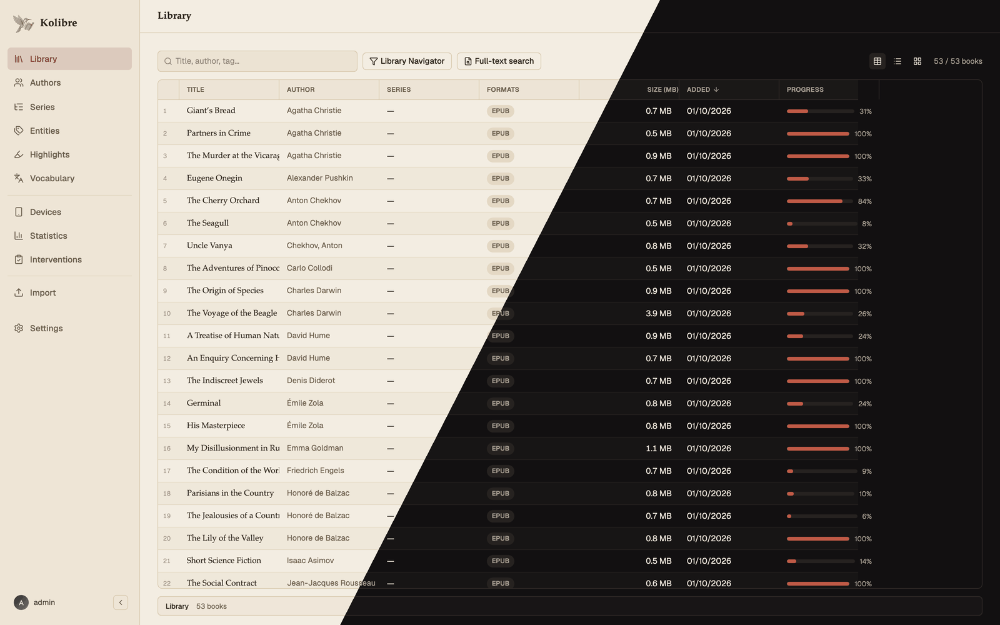

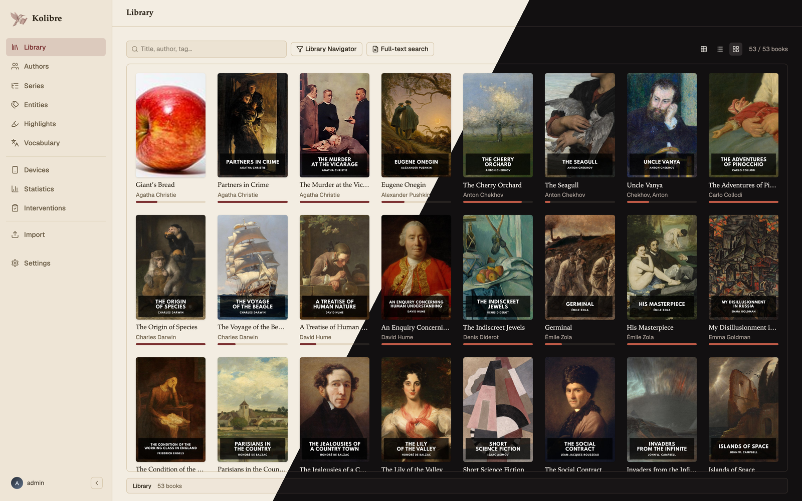

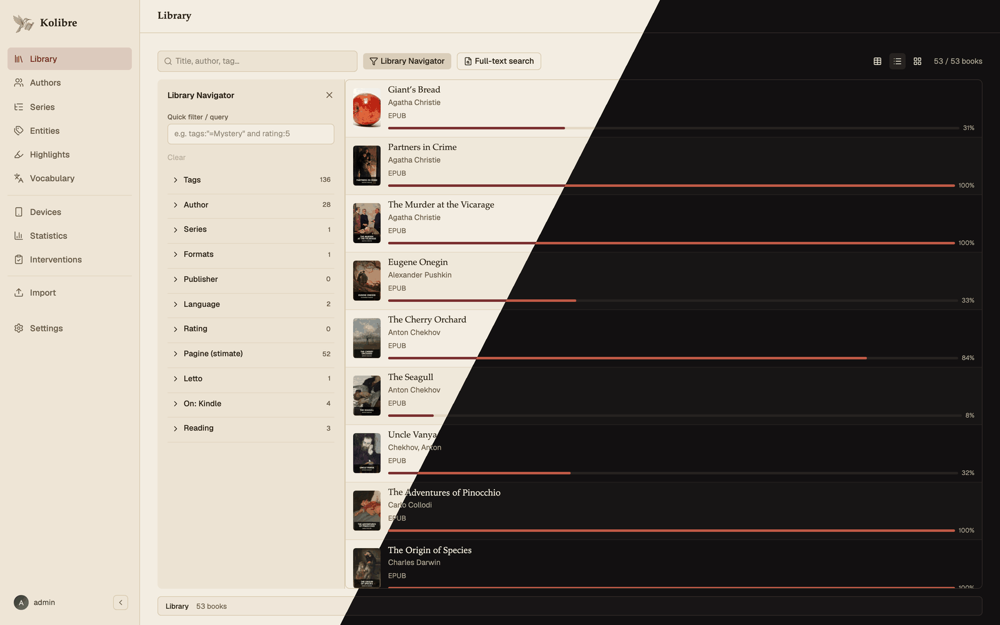

> **Web reader** — Kolibre can open EPUB and PDF in the browser, with text selection,
> highlighting, search, themes and position sync back to your devices. It is **still
> rough**, and deliberately not the point: it exists for checking a passage from your desk,
> not for reading a novel.

### Book detail

One page per book, with everything the file and the library know about it.

- Every metadata field, editable in place, including Calibre custom columns
- **Formats** — add, remove, convert between them (Calibre's `ebook-convert` under the
  hood, when available)
- **Cover** — replace it, or let Kolibre build a readable one for books that have none
- **Table of contents** — inspect it, regenerate it, or anchor entries by hand when a badly
  produced EPUB has none
- **Metadata search** online, with a side-by-side comparison before anything is written
- **Reading progress and coverage** — how much of this book you have actually been through,
  measured in characters rather than "pages", which depend on the font size
- **Highlights** from every device, inline

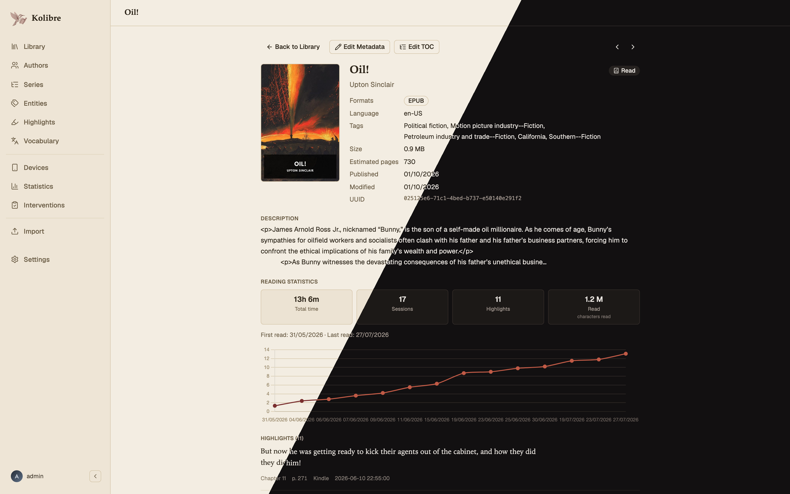

### Authors

Every author in your libraries, as a grid of portraits or a sortable table — and the view
you chose is remembered.

- **Biography, dates, nationality, occupations and photo**, fetched automatically from
  **Wikipedia and Wikidata** where they can be found
- Anything missing can be written by hand, and anything wrong corrected — including
  pointing the fetcher at a specific Wikipedia page when the automatic match picks the
  wrong person
- **Photo** from a Wikimedia Commons search, from a pasted image address, or uploaded
- **Per-author reading statistics**: how long you spent with them, how many of their books
  you finished
- An A–Z index down the side when the list is alphabetical


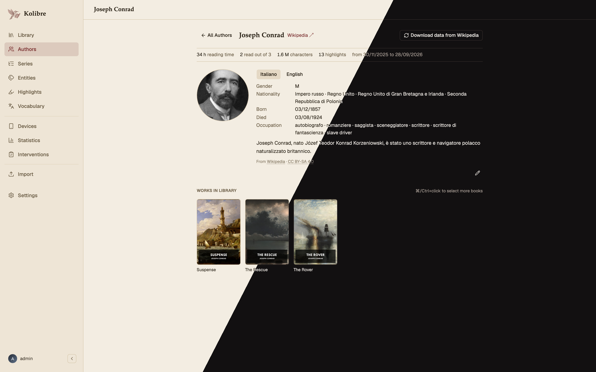

### Series

Which series you own, which volumes are missing from the numbering, and where you stopped.
Series can also be dissolved — the books stay, they just stop belonging to it — or turned
into a tag.


### Annotations

Every highlight and note from every device, in one place, **searchable inside the text**,
with the matching words marked in the passage itself.

Three ways to look at the same set, because they answer different questions:

| View | Answers |
|---|---|
| **Reading** | "Show me something I forgot I marked" — one passage after another, nothing else on screen |
| **Shelf** | "Everything from the book I just finished" — a card per book, with a taste of what is inside |
| **Index** | "That one passage I remember" — a narrow list beside the full passage |

- Your own **notes** on any highlight, kept separate from the quoted text
- **Open in the reader** at the exact position — and when the anchor no longer holds
  (re-imported file, failed conversion), Kolibre finds the passage by its text instead
- **Export** to Markdown or HTML, one file or one per book
- A **trash**, because deleting is a decision too: deletion asks first, and is undoable

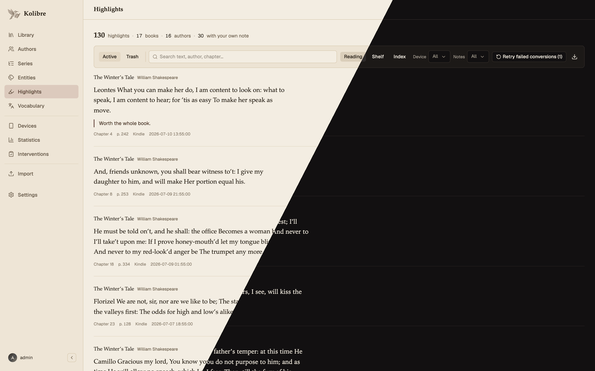


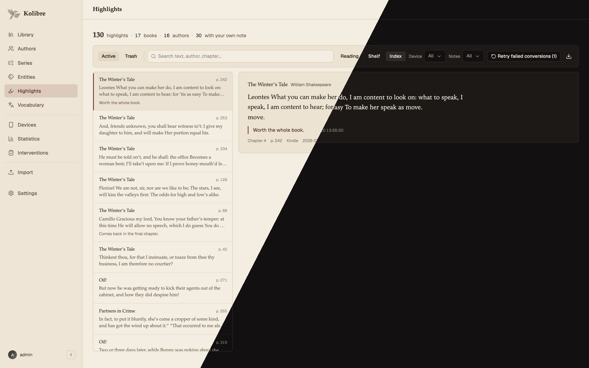

### Vocabulary

The words you looked up on the device while reading, collected instead of lost — with the
book and the passage they came from, and definitions from offline StarDict dictionaries
that Kolibre can install for you.

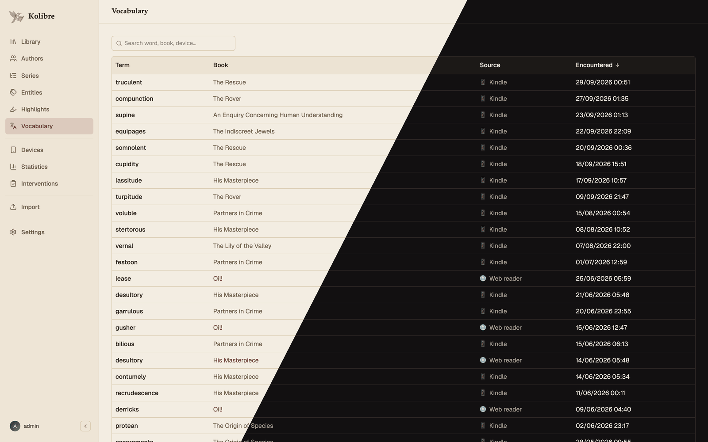

### Devices

One card per paired e-reader.

- What it currently holds, and what is queued to be sent or removed
- **Free space** on the device, reported by the plugin at every sync
- **Plugin version**, with a line telling you which devices are behind
- **Sync history** that says *what actually happened* in words — "4 books received · 2
  removed · 118 reading rows · notes and positions sent" — instead of six columns of
  numbers where a zero and a never-ran look the same
- **Backups** of the device's own KOReader configuration and statistics
- **Needs review** — books the device reports that Kolibre could not match to anything in
  your libraries

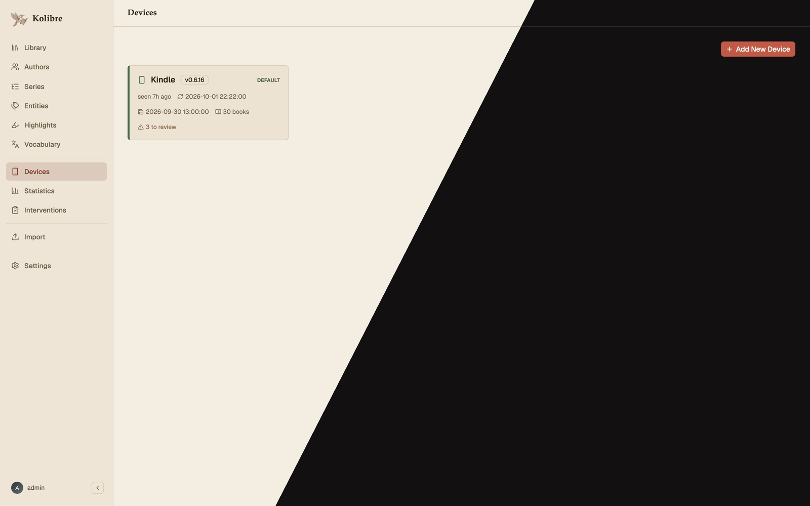

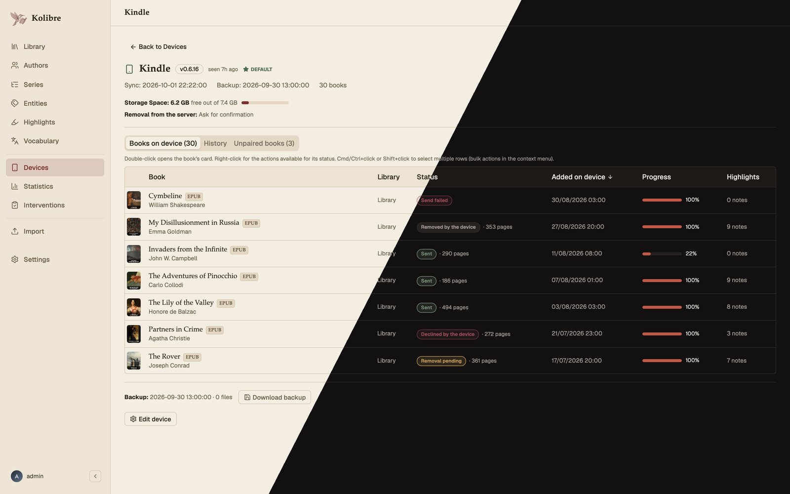

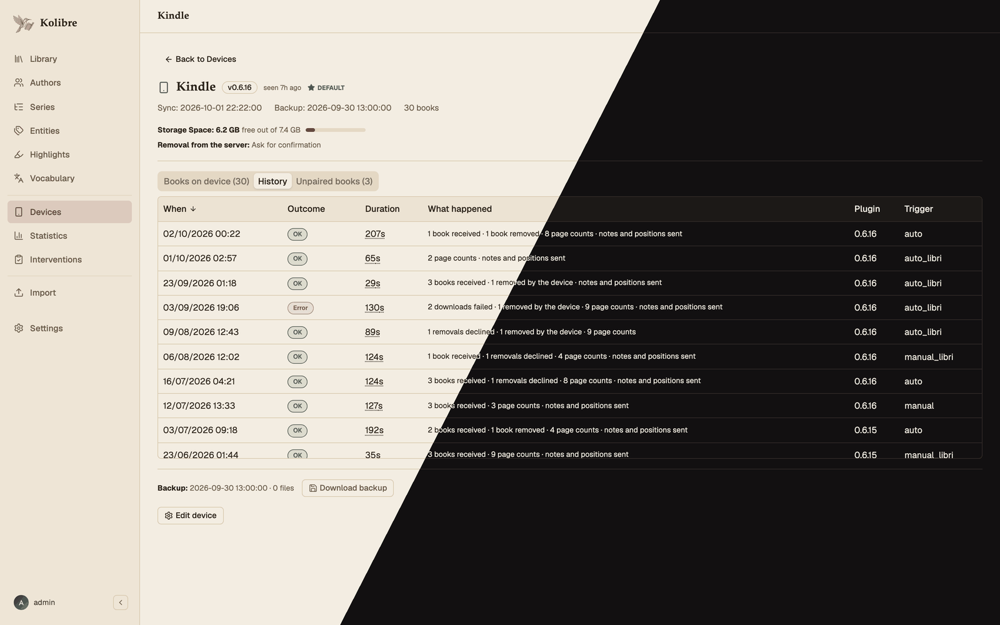

### Statistics

Two halves that answer two different questions.

**Library — what you own**

Formats and the space they take, book lengths, languages, tags, ratings, top authors and
series. Plus what the author data makes possible: **which era your authors were born in,
where they came from, what they did for a living.**

**Reading — what you did**

Scoped to all libraries at once, because "how much have I read in my life" is not a
property of a folder.

- Time read, characters read, books finished, current streak
- **Personal records**: best year, longest book, longest streak, the author you spent most
  time with
- **Per-day histogram** and a **ten-week histogram**, each switchable between minutes and
  characters — the two measure different things: minutes say how much *time* a book took,
  characters how much of it you *covered*
- A **year heatmap**, and a **reading calendar** that puts the actual book titles inside
  each day, with the time spent
- **Always-on statistics** that ignore the period filter because the question does not
  depend on it: characters by hour of the day, reading speed by hour, the fastest and
  slowest books you read, the ten authors you spent most time with, and the books you
  finished broken down by their author's birth decade, trade and country
- A **custom chart builder** for anything not covered

Where a number would be misleading, it is not shown: a reading speed computed from four
minutes of data says more about the sample than about you, so it is excluded and the page
says how many were excluded.

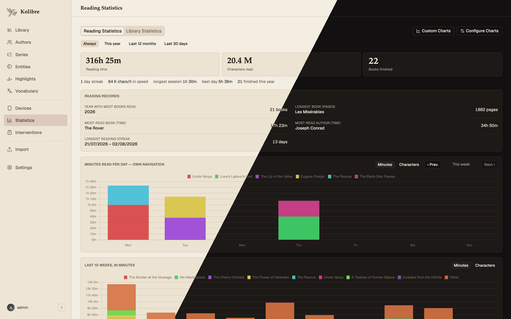

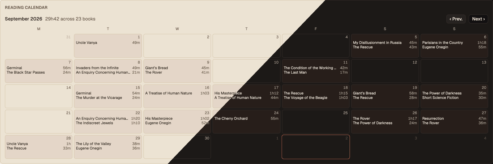

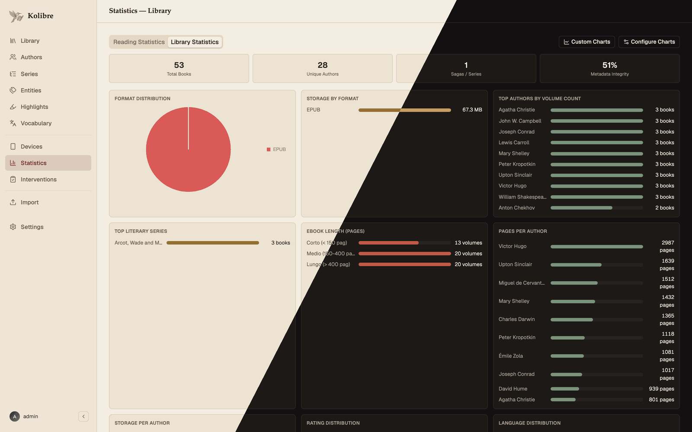

### Entities

Authors, series, tags and publishers are the names that hold a library together, and in a
real library they are a mess: `Cortázar, Julio` and `Julio Cortazar`, `Aa. Vv.` and
`AA. VV.`, the same publisher spelled three ways.

- Finds the **duplicate spellings** and proposes a merge, **across every library at once** —
  disorder in names does not stop at a folder boundary
- The suggested spelling is the one an **online source recognises**, not the one with the
  most books: the number of books knows nothing about how a name is written
- Merging rewrites every affected book **and moves the files on disk** to match
- Tells you the state of each author's data — biography, photo, facts — as sortable
  columns, so you can see who still needs looking up
- You can also say **"these two are different people"**, and it remembers. Giuseppe Berta
  is a historian and Giuseppe Berto a novelist; no algorithm will ever know that

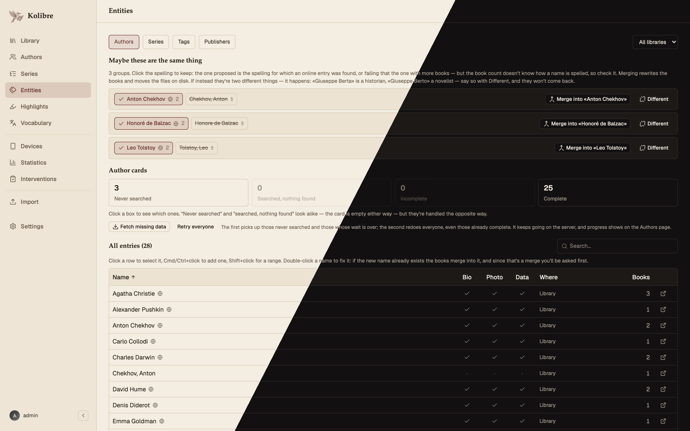

### Interventions

Everything that needs a decision, in one queue, so that nothing is decided behind your
back:

- **Possible duplicates** inside a library, compared by metadata, then by file hash, then
  by a quality score — with the option to merge (the loser hands over its highlights,
  reading sessions and positions) or to declare them different for good
- **Notes without a book** — highlights a device reported for a file Kolibre never saw
- **Notes that lost their place** — they have a book, but not a position in it
- **Books that look read** — coverage says you finished them, but the checkbox is yours to
  tick

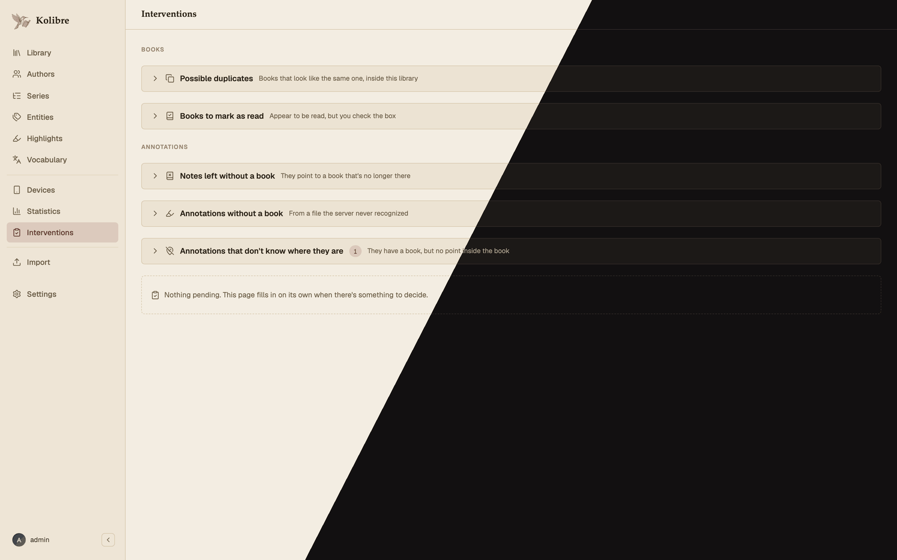

### Import

A watched folder: drop files in, and Kolibre stages them instead of importing blindly.

- Metadata read from the file itself, cover extracted, both editable before import
- **"You may already have this"** — a possible duplicate is flagged before it gets in, not
  after
- Import one, a selection, or everything, into any library you can write to

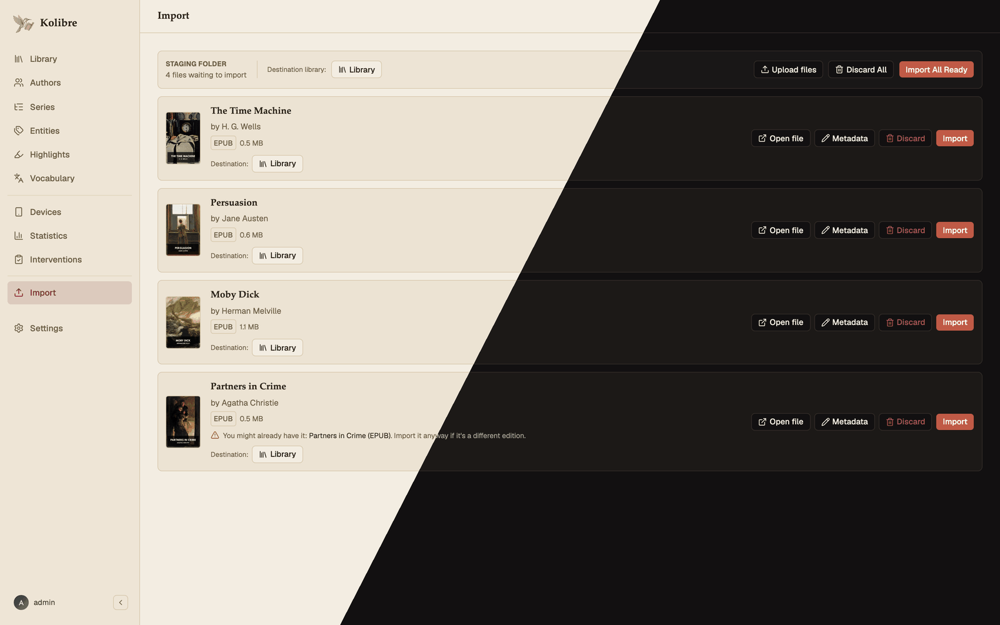

### Settings

Eight sections: **Profile** · **Appearance** · **Libraries** · **People** · **Devices** ·
**Integrations** · **Bulk operations** · **System**.

- **Libraries** — create, import an existing Calibre folder, share with another user with
  read or write permission, full-text indexing per library
- **People** — accounts and what each one may do: create libraries, register devices,
  manage others
- **Appearance** — the interface language, and **ten themes** chosen as a *pair*: one
  light, one dark, plus the rule that decides which is active — follow the operating
  system, or pick one and stay there. Then cover size, table density, date format, and a
  drag-and-drop builder for the sidebar
- **System** — keyboard shortcuts, server log, maintenance commands, the running version,
  and everything described under [Large libraries](#large-libraries)

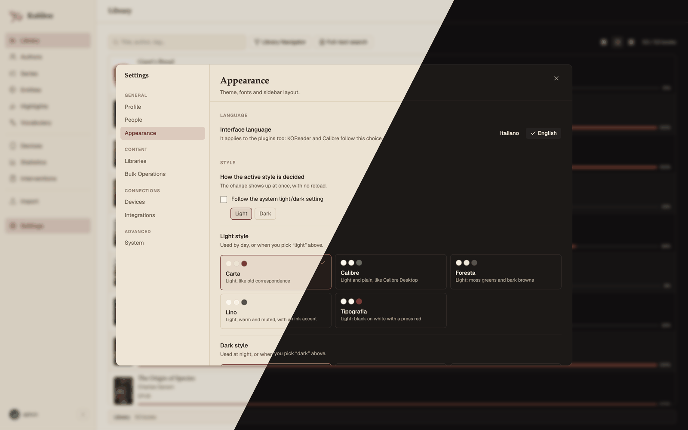

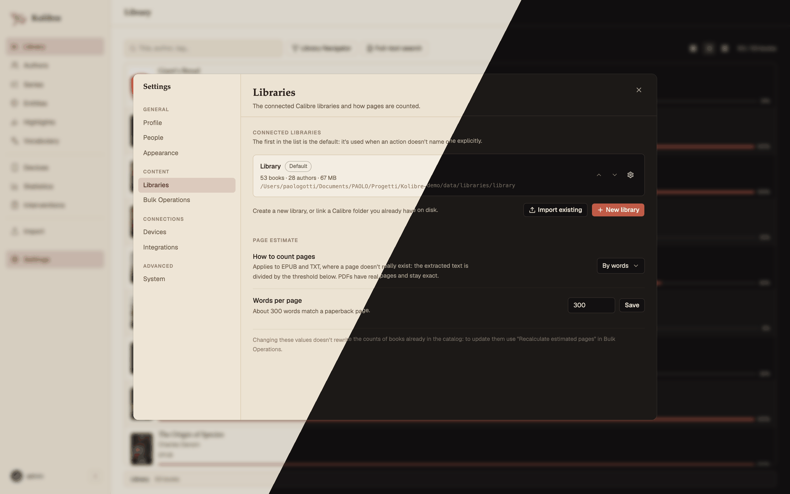

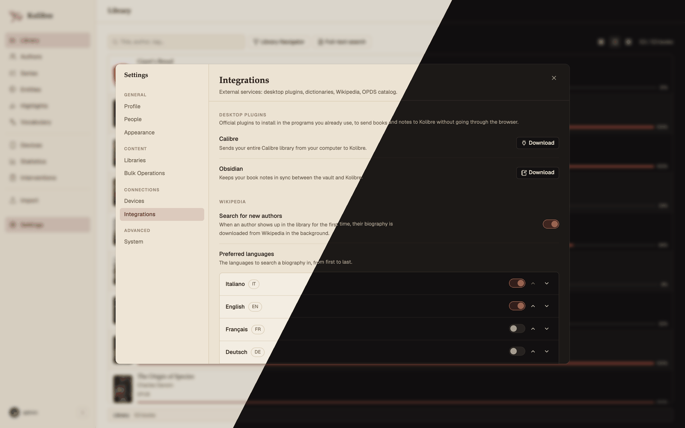

---

## Integrations

### KOReader — the one that matters

This is the piece that makes the whole idea work. The plugin is installed once over USB,
then **updates itself over Wi-Fi** from your own server — on demand, or automatically at
startup if you turn that on.

- **Send and remove books.** You choose on the server; the device applies it at the next
  sync. Removals can be automatic, confirmed on the device, or never — your choice, per
  device.
- **Sync back everything the device knows**: reading positions, reading statistics,
  highlights and notes, and the words you looked up.
- **Back up KOReader itself** — its settings, its reading history, its statistics database.
  This was the thing missing everywhere else: the e-reader was the only device with no
  backup.
- **Quick check** — a fast sync that only looks at new and removed books, skipping the full
  round of statistics and annotations. It is the default on startup, because that is the
  moment you want your new book to be there.
- **Automations** — what should happen on startup, on wake, when a book is opened or
  closed.
- **Browse the library from the device** — the catalogue, with covers, on the e-reader.
  *(Honestly: against the philosophy above. It is there because sometimes you want it.)*
- **Initialize library** — the command for a device you have been using for years. It walks
  every book already on the e-reader, finds the ones Kolibre does not know about yet, and
  proposes a match against your library. On a device with hundreds of books it takes a few
  minutes, and it is the first thing to run after installing the plugin on a reader with a
  life of its own. Nothing is paired without you saying so.
- **Folder layout for [Project Title](https://github.com/joshuacant/ProjectTitle)** — the file tree is written as an
  author list with portraits, so the cover browser shows a real shelf.

Statistics are sent **incrementally**: a device that has been reading for two years has a
statistics database of several hundred kilobytes, and uploading all of it at every sync was
slow for no reason. Only the new rows travel.

### Calibre — because it is still the best editor

Calibre remains unbeatable for conversion, TOC surgery and metadata editing. Kolibre does
some of that, but not as well, and pretending otherwise would be silly.

The workflow this plugin exists for: you have an EPUB on your computer, you open it in
Calibre, you check it and fix it, and you send it straight into a Kolibre library.

- **Upload library to Kolibre** — the first-run command: it takes an entire Calibre
  library and creates it on the server, covers, formats, custom columns and annotations
  included. You pick which custom columns travel. This is how you start, if what you have
  today is a Calibre library on your desktop and nothing on the server yet.
- **Send to Kolibre library…** — one book or a selection, to any library you can write to
- **Send to Kolibre and delete from here…** — for when Calibre was the workbench, not the
  home. It asks first, naming the library, and it only deletes the books that actually
  reached the server: if a send fails, that book stays in Calibre. The deletion goes
  through Calibre's own delete, so it honours the recycle bin
- **Paired libraries** — keep a local Calibre library and a Kolibre one in step, with a
  diff before anything is applied
- Reads the server's library list, so you never type a path
- Sends covers, formats, custom columns and annotations together

### Obsidian — notes where you actually keep them

Highlights become Markdown in your vault, automatically, instead of being copied over one
at a time. One file per book, in a folder you choose, named by a template
(`{{title}}`, `{{author}}`).

> **Still in development**, and the reason is a real tension: once a note is in the vault
> you want to *edit* it — add links, rewrite it, connect it to something — but you also
> want new highlights to keep arriving. The plugin has to work out when to stop touching a
> note and when to add to it. Several approaches are being tried; this one works, and is
> not final.

**What a note looks like.** The book's own chapter structure becomes nested Markdown
headings, so a highlight sits under the chapter it came from rather than in a flat list.
Each passage carries its page, its note if you wrote one, and a small badge saying where it
came from — the device, Calibre, or Kolibre's own web reader.

**How it updates without eating your writing.** This is the part that matters, and the part
most tools of this kind get wrong.

Every imported highlight leaves an invisible marker in the file. The set of markers already
there **is** the "what is new" filter — there is no separate sync log to drift out of step
with the vault, and nothing breaks if you move a file, rename it, or edit it on another
machine. New highlights are then inserted **in page order**, next to the ones already
written, instead of being appended in a heap at the bottom.

And when the plugin finds something it did not write — a paragraph of your own between two
highlights, a link, a thought — that section switches to adding at the end instead of
reordering. Reordering around text it does not understand could corrupt it; appending never
can. Anything you wrote *above* the first highlight is left exactly where it is, always.

The practical consequence: a book you are still reading keeps receiving new passages into a
note you have already made your own.

There is also a **Reimport everything** command, which rebuilds every file from scratch with
the current format. It asks first, in as many words, because it is the one operation that
does throw away what you wrote.

It also updates itself from your own server — a button in its settings, not something
that happens behind your back.

---

## Install

You need Docker with Compose. Two containers: backend (FastAPI + SQLite) and frontend
(compiled React, served by nginx).

```bash
git clone https://github.com/GottiPaolo/Kolibre.git
cd Kolibre
cp .env.example .env
$EDITOR .env          # ports, data folder, first user
docker compose up -d
```

Then open `http://<your-machine>:8080` (or whatever you set as `FRONTEND_PORT`) and log in
with the credentials from your `.env`.

**What to actually change in `.env`:**

| variable | what it does |
|---|---|
| `FRONTEND_PORT` / `BACKEND_PORT` | exposed ports. Plugins talk to the **backend**, your browser to the frontend |
| `DATA_PATH` | where libraries, databases and device backups live. **Back this folder up** |
| `ADMIN_USERNAME` / `ADMIN_PASSWORD` | the first user, created only on the very first start |

`SECRET_KEY` is optional: leave it alone and Kolibre generates one on first start, keeping
it in your data folder.

### Using a Calibre library you already have

A Kolibre library **is** a Calibre library: same `metadata.db`, same folder structure. You
can point it at an existing one without converting anything — uncomment the mount in
`docker-compose.yml`:

```yaml
- /real/path/to/your/library:/external-library
```

then import it from **Settings → Libraries**. Nothing is copied: Kolibre points at the
folder where it already is, and Calibre Desktop can keep opening it at the same time.

---

## Large libraries

Kolibre is built for a library you actually have, which for most people is a few thousand
books. Past that it starts asking the server to do more work and the browser less, and all
of it is **visible and switchable** in *Settings → System → Large libraries*. The numbers
below were measured against a test library of 100,000 books.

**Three independent paginations**, each with three modes — automatic past a threshold,
always, never:

| What | Past the threshold | If you turn it off |
|---|---|---|
| **Library** | The page asks the server for one page at a time, and search and sorting run in SQLite across the whole library | It downloads the entire catalogue. With tens of thousands of books that is slow |
| **Authors** | It draws N cards at a time | A card for every author: at twenty thousand authors that is 180,000 DOM nodes and a search that takes twelve seconds |
| **Import** | One page of pending files at a time | A card for every pending file |

The thresholds and page sizes are yours to set. The important part is that past the
threshold **search and sorting still cover the whole library**, not the page you are looking
at — a paginated view that silently searches only what it has loaded is worse than no
pagination at all.

**Full-text search has a cap, and you choose it.** The index holds the text of every book
and weighs roughly 1.5 MB per book: at 100,000 books that would be over 150 GB. Set a cap in
gigabytes and indexing stops when it is reached — nothing already indexed is deleted, and
everything in the index stays searchable. `0` means no cap. You can also leave full-text
search off entirely: everything else works without it.

**Statistics are precomputed** in the background rather than recalculated every time you
open the page, and catalogue counts are done in SQL rather than by downloading the catalogue
to count it in the browser.

None of these is a hidden limit. Every one of them says, in the settings page itself, what
it costs to switch it off — because the honest version of "it gets slow with a lot of books"
is a number and a switch, not a disclaimer.

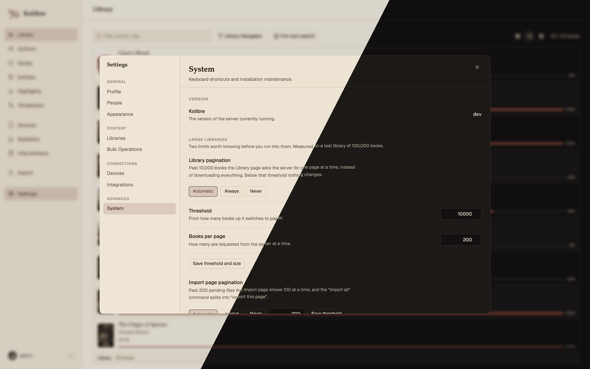

---

## A note of modesty

This was built by one person, for one person's reading habits, with a lot of help from an
AI pair. It solves problems I actually had. It may not solve yours, and it certainly does
not solve them the way a team of ten would have.

The parts I am least sure about are the ones I use least — the web reader, the Obsidian
flow, anything involving more than two users. If something looks wrong, it probably is.

---

## Project status

**Not stable.** It changes often, and some parts are clearly more finished than others.
The database migrates forward but not backward.

If you want to use it: **back up your data folder**, and do not trust it blindly.

### Security

Kolibre is built for a home network. Before exposing it to the internet, read
[SECURITY.md](SECURITY.md) — it says plainly what is protected, what is not (there is no
rate limiting on login, among other things), and how to report a problem.

### Credits

Kolibre stands on other people's work:

- **[Calibre](https://calibre-ebook.com)** — the library format, and the algorithms that
  produce identical sort keys and folder names. Kolibre ports them, and says where.
- **[KOReader](https://github.com/koreader/koreader)** — the only e-reader software open
  enough to make any of this possible.
- **[Project Title](https://github.com/joshuacant/ProjectTitle)** — the cover browser the folder layout is shaped
  for.
- **[Wikipedia](https://www.wikipedia.org) and [Wikidata](https://www.wikidata.org)** —
  author biographies and facts.
- **[Standard Ebooks](https://standardebooks.org)** — the beautifully produced public
  domain editions used in the screenshots on this page. Go and look at what they do; it is
  a remarkable project.

### Contributing

The discussion I would most like to have is **not about the code**. It is about the
philosophy above: reading with digital tools has enormous advantages that almost nobody
exploits. If you have ideas, objections, or a completely different way of seeing it,
**issues are the right place** — more than pull requests, for now.

---

## Repository layout

```
backend/          FastAPI + SQLAlchemy + SQLite; talks directly to Calibre's metadata.db
frontend-react/   React + TypeScript + Tailwind; static build served by nginx
plugins/
  koreader/       KOReader plugin (.koplugin, Lua) — full sync
  calibre/        Calibre Desktop plugin (Python/Qt) — "Send to Kolibre library…"
  obsidian/       Obsidian plugin — highlights as Markdown in your vault
docs/immagini/    the screenshots on this page
```

## License

[GNU AGPL-3.0-or-later](LICENSE). Kolibre contains code derived from Calibre (GPL-3.0) and a plugin
that lives inside KOReader (AGPL-3.0) — [NOTICE](NOTICE) lists exactly what comes from
where, and why the licence is what it is.
